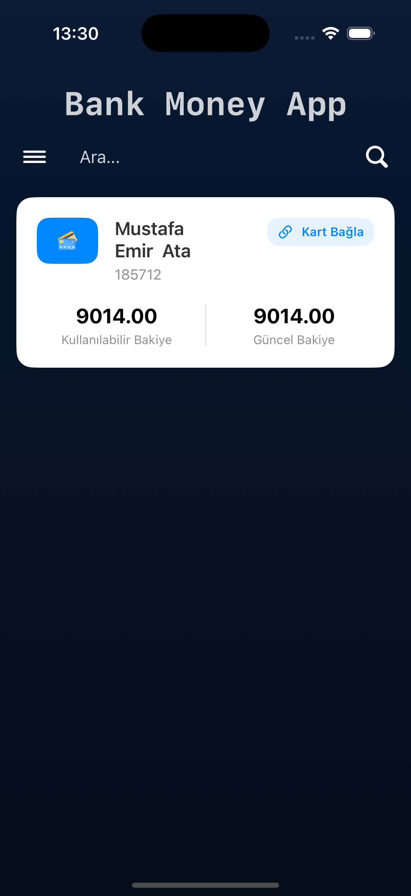
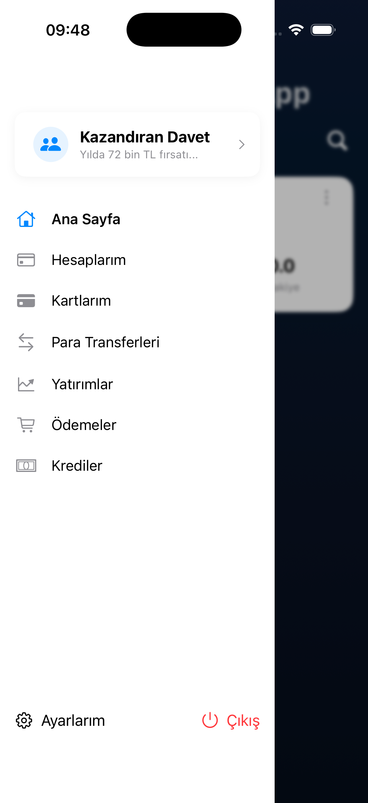
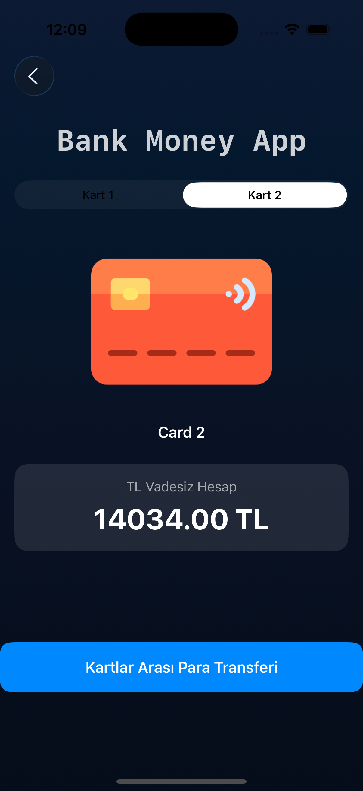
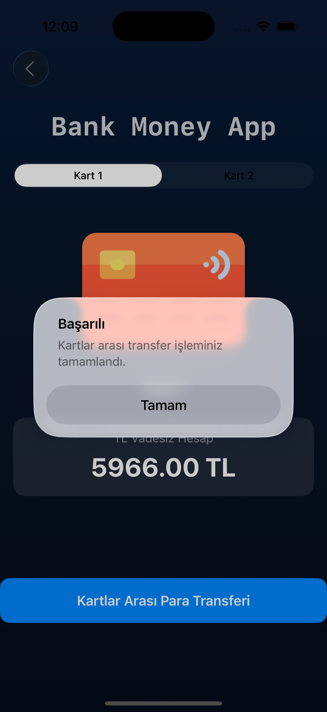
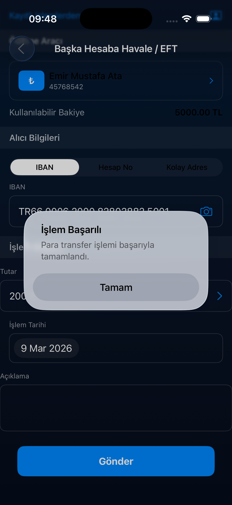
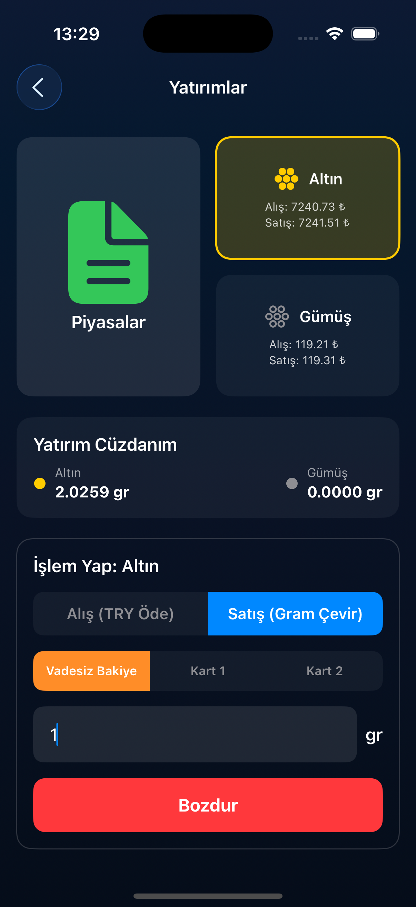
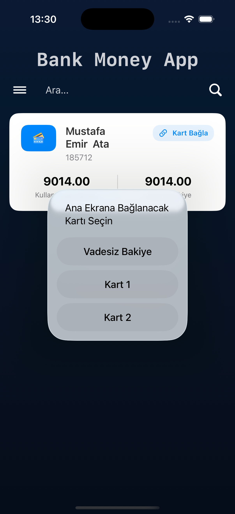

# 💳 BankMoneyApp

**BankMoneyApp**, SwiftUI tabanlı modern bir mobil bankacılık uygulaması prototipidir.
Firebase altyapısı kullanılarak **kullanıcı kimlik doğrrulama**, **gerçek zamanlı veri yönetimi** ve **finansal işlemler** simüle edilmiştir.

---

# 🚀 Kullanılan Teknolojiler

* **Dil:** Swift (SwiftUI)
* **Backend:** Firebase Authentication & Firestore
* **Mimari:** MVVM (Model-View-ViewModel)
* **Araçlar:** Xcode, Git

---

# 📱 Uygulama Özellikleri

* 🔐 **Güvenli Giriş**
  Firebase Authentication ile kullanıcı kayıt ve giriş sistemi.

* 🏦 **Hesap Yönetimi**
  Kullanıcıya özel dinamik ana sayfa ve bakiye görüntüleme.

* 💳 **Kart İşlemleri**
  Kullanıcıya ait banka kartlarını listeleme ve görüntüleme.

* 💸 **Para Transferi**
  Kullanıcılar arası hızlı para gönderimi.

* 📊 **Yatırım Ekranı**
  Yatırım varlıklarını görüntüleme ve takip etme.

* 📱 **Modern UI**
  SwiftUI ile tasarlanmış iOS uyumlu kullanıcı arayüzü ve **Side Menu navigasyonu**.

---

# 🏗️ Proje Mimarisi

Projede **MVVM mimarisi** kullanılmıştır.

Bu mimari sayesinde:

* UI ve iş mantığı ayrılmıştır
* Kod okunabilirliği artar
* Proje kolay ölçeklenebilir

```
BankMoneyApp
│
├── Views
├── ViewModels
├── Models
├── BankApp/Images
└── Firebase Services
```

---

# 📷 Uygulama Ekranları

## 🏠 Ana Sayfa & Yan Menü

| Ana Sayfa                    | Yan Menü                         |
| ---------------------------- | -------------------------------- |
|  |  |

---

## 💳 Kartlarım & Transfer İşlemleri

| Kartlarım                         | Kart Transferi                       | Para Gönderimi                   |
| --------------------------------- | ------------------------------------ | -------------------------------- |
|  |  |  |

---

## 📊 Yatırım & Hesap Bağlama

| Yatırım Ekranı                     | Hesap Bağlama                   |
| ---------------------------------- | ------------------------------- |
|  |  |

---

# 🔥 Firebase Kullanımı

Uygulamada iki temel Firebase servisi kullanılmıştır.

## Authentication

Kullanıcıların:

* Kayıt olması
* Giriş yapması
* Oturum yönetimi

işlemleri için kullanılmıştır.

## Firestore

Aşağıdaki veriler Firestore üzerinde saklanır:

* Kullanıcı bilgileri
* Kart verileri
* Finansal işlemler

---

# 🛠️ Kurulum

### 1️⃣ Repoyu klonla

```bash
git clone https://github.com/mustafaemirata/BankMoneyApp.git
```

### 2️⃣ Xcode ile aç

```
BankMoneyApp.xcodeproj
```

### 3️⃣ Firebase ayarlarını ekle

* Firebase Console üzerinden proje oluştur
* **GoogleService-Info.plist** indir
* Projenin kök klasörüne ekle

### 4️⃣ Uygulamayı çalıştır

```
Cmd + R
```

---

# 👨‍💻 Geliştirici

**Mustafa Emir Ata**

GitHub
https://github.com/mustafaemirata

---

